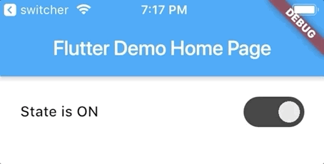

# dark_pure_switcher

**dark_pure_switcher** widget for Flutter project.



## Getting Started

For use **dark_pure_switcher** widget in your project:
1. Add dependency in the **pubspec.yaml** file
```dart
    dependencies:
        flutter:
            sdk: flutter
        dark_pure_switcher:
            git:
                url: git@github.com:shekunsky/FLUTTER-dark_pure_switcher.git
```

2. Import widget in the dart file:
```dart
    import 'package:dark_pure_switcher/dark_pure_switcher.dart';
    import 'package:dark_pure_switcher/dark_pure_mode_switcher_state.dart';
```

3. Make an instance of the widget.

    ```dart
         DarkPureSwitcher(
                state: DarkPureModeSwitcherState.on,
                valueChanged: (state) {
                  if (state == DarkPureModeSwitcherState.on) {
                    print('Switcher ON');
                  } else {
                    print('Switcher OFF');
                  }
                },
              )
    ```
    
    
    ## License

    Windmill Smart Solutions 2020 ©